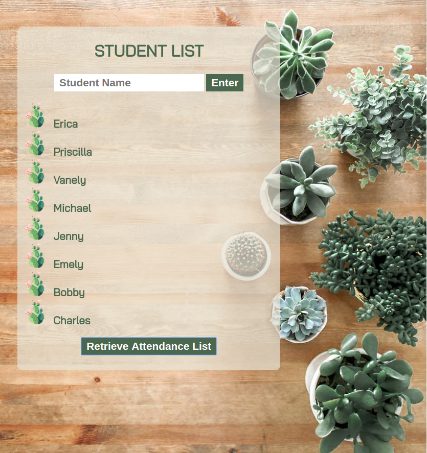

# Student List
Build a Simple Student List App For A Teacher. Create a simple app where a teacher can enter student names as they arrive at class. The teacher should have the ability to press a button and see a list off all the students who have arrived.

**Link to project:** https://pensive-kare-e17bef.netlify.com

## How It's Made:

**Tech used:** HTML5, CSS3, JavaScript.
Styling for this project was done using a CSS Grid layout. Written in vanilla Javascript.

## Examples:

**OOP Calculator:** https://github.com/Eriquette/week01-alumni-project-calculator/tree/answer

**Carousel Picture Gallery:** https://github.com/Eriquette/carousel-bootcamp2018c-week05/blob/answer

**Daily Code Challenges:** https://github.com/Eriquette/Daily-Code-Challenges
