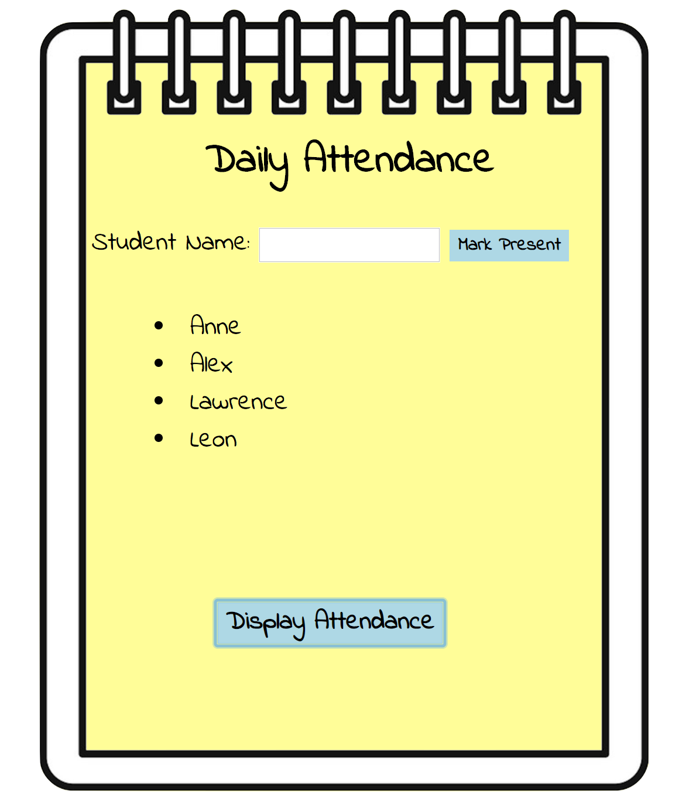

# Daily Attendance
This project is an attendance list to keep track of students as they show up to class. The attendance list allows you to add new students, and displays the complete attendance at the click of a button.

**Link to project:** https://sleepy-franklin-b8d685.netlify.com/

## How It's Made:

**Tech used:** HTML, CSS, JavaScript

Using JavaScript I programmed a form to log students entered into the attendance list. The user has the ability to enter a student name which is then appended to a hidden ul. After completing all entries into the attendance list, the user can then click on "display attendance" to view the list of students.

## Optimizations

One feature I would like to add to this project is the ability to store attendance history. When the user clicks on the name of a student, they would be able to see all previous entries.

## Lessons Learned:

Hiding elements to be displayed later in the DOM.

## Related Projects:
Take a look at these cool projects that I have in my portfolio:

**To-Do List:** https://tender-ritchie-caee3b.netlify.com/

**Slot Machine:** https://github.com/alecortega/twitter-battle

**Carousel:** https://mystifying-stallman-5862e0.netlify.com/
